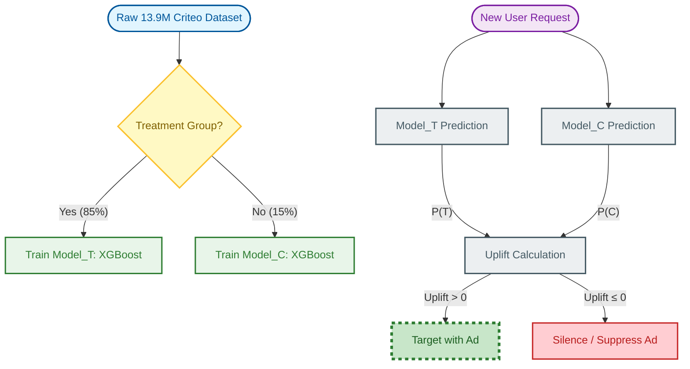

# 🚀 Uplift Targeting Engine: Maximizing Ad ROI with Causal AI

[](https://www.python.org/downloads/)
[](https://xgboost.readthedocs.io/)
[](https://ailab.criteo.com/criteo-uplift-dataset/)
[](https://opensource.org/licenses/MIT)

## 📌 Executive Summary
Traditional marketing systems target users who are *likely to buy*. This is inefficient because it wastes money on users who would have bought anyway (**"Sure Things"**).

This project implements a **Causal Uplift Model** (T-Learner) using 13.9 million rows of real-world randomized control trial (RCT) data. It predicts the **incremental impact** of an ad, allowing businesses to target only the **"Persuadables"**—users who convert *only because* of the intervention.

### 💰 Business ROI Decision Matrix
| Segment | Conversion if Treated | Conversion if Control | Recommended Action |
| :--- | :--- | :--- | :--- |
| **Persuadables** | High | Low | **Target** 🎯 |
| **Sure Things** | High | High | **Avoid** (Save $) |
| **Lost Causes** | Low | Low | **Avoid** (Save $) |
| **Sleeping Dogs** | Low | High | **CRITICAL AVOID** ⚠️ |

---

## 🛠️ Technical Architecture



### 🧠 Methodology: The T-Learner
The system trains two independent gradient-boosted trees (XGBoost):
1.  **Treatment Model ($M_T$):** Learns behavior under exposure to ads.
2.  **Control Model ($M_C$):** Learns baseline organic behavior.

**Uplift Score calculation:**
$$\text{Uplift} = P(\text{Conversion} | \text{Treated}) - P(\text{Conversion} | \text{Control})$$

### 📊 Performance Metrics (Phase 4 Evaluation)
*   **Dataset Size:** 13,912,825 rows.
*   **ROC-AUC (Treatment):** **0.9584** (Excellent discrimination).
*   **Ranking Logic:** Qini Curve analysis confirms significant uplift gain in the top 2 deciles.

---

## 📂 Project Structure
```text
├── notebooks/          # EDA and Model Evaluation (Calibration, Qini, ROC)
├── models/             # Pre-trained XGBoost Models
├── evaluate_full_model.py # Evaluation pipeline
├── train_full_model.py   # Training pipeline
├── requirements.txt    # Project Dependencies
└── README.md           # This documentation
```

---

## 🚀 Getting Started

### 1. Prerequisites
Python 3.9+, pip, and an active virtual environment.

### 2. Quick Install
```bash
git clone https://github.com/srinath2934/uplift-targeting-engine.git
cd uplift-targeting-engine
pip install -r requirements.txt
```

---

## 🤝 Acknowledgments
*   **Criteo AI Lab:** For providing the massive-scale open-source dataset.
*   **XGBoost Team:** For the industry-standard gradient boosting framework.

---
**Developed by [Srinath](https://github.com/srinath2934)**
